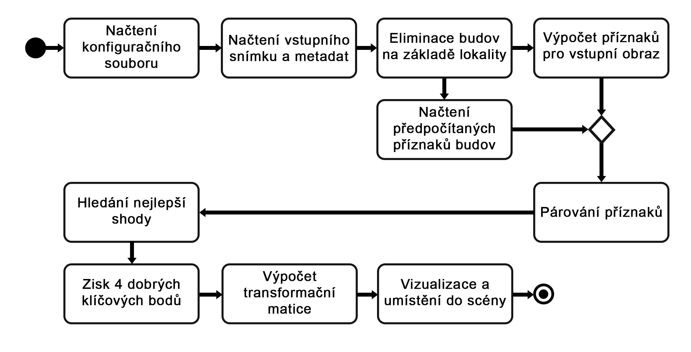
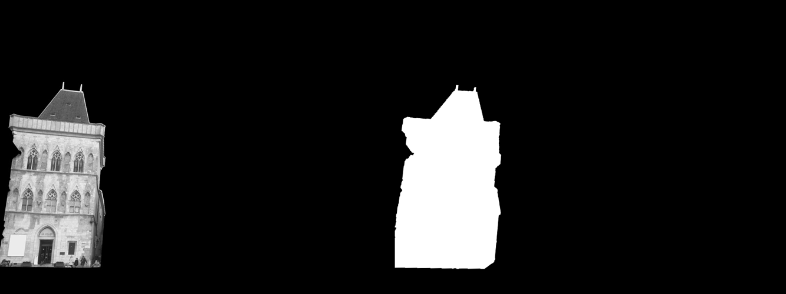

# Nástroj pro detekci urbanistické scény
Tento nástroj vznikl jako praktický výstup bakalářské práce. Jedná se o program, který rozezná budovu na snímku a umístí na něj snímek budovy z databáze. Pro výpočet příznaků je použitý SIFT, pro jejich párování je použitý FLANN matcher a poté jsou vybrány dobré spojení pomocí poměrového testu.

# Instalace
**potřebné knihovny/moduly** a verze, které byly použity při vývoji
- [OpenCV](https://opencv.org/) - opencv-python==3.4.2.16, opencv-contrib-python==3.4.2.16
- [Pillow](https://pypi.org/project/Pillow/) - PIL==7.0.0
- [Numpy](https://numpy.org/) - numpy==1.17.4

Doporučuji instalovat moduly jako správce/administrátor  

``pip install opencv-python==3.4.2.16``  
``pip install opencv-contrib-python==3.4.2.16``  
``pip install pillow numpy``  

Dále jsou používané moduly, které jsou součástí standardní kníhovny: os, json, pickle, math  

Zdůvodu patentovaných metod SURF a SIFT je potřeba si naistalovat i OpenCV contribution [verzi](https://pypi.org/project/opencv-contrib-python/). V práci jsem používal verzi **opencv-contrib-python==3.4.2.16**. Pokud nainstakujete novější/vyšší verzi, než je verze 3.4.2.16, tak při spuštění obdržíte tento error: ``This algorithm is patented and is excluded in this configuration; Set OPENCV_ENABLE_NONFREE CMake option and rebuild the library in function 'cv::xfeatures2d::SIFT::create'``

Před prvním spuštěním je potřeba zkontrolovat, zda jsou vygenerované potřebné soubory viz Info->První spuštění   

# Info
## První spuštění
Předpokládá se, že není vygenerovaný config, metadata budov, předpočítané příznaky a klíčové body.
0) Generování konfiguračního souboru pomocí [config.py](./config.py) (před způštěním *app.py* se vždy config automaticky přegeneruje, aby se nemusel pořád manuálně aktualizovat)
1) Generování metadat pomocí skriptu [json_data.py](./json_data.py)
2) Poté mohou být předpočítané příznaky pomocí [extract_features_db.py](./extract_features_db.py)
3) Spuštění nástroje: [app.py](./app.py)

## Jak přidat novou budovu do databáze?  
Je potřeba oříznout fotografie, tak aby mohli být použité pro rozpoznání. Pro novou budovu vytvořete složku b(číslo budovy) např. b11. Do této složky uložte upravené fotografie. Dále je potřeba vytvořit metadata budovy ve skriptu [json_data.py](./json_data.py). Pokud chcete i zobraz samotnou transformaci fotky z databáze je potřeba vytvořit složku např. b_11_original a zde uložit soubor s originální fotkou o stejném rozměru jako ten upravený snímek v databázi. Posledním krokem je potřeba spustit výše zmíněné skripty pro přegenerování souborů a poté ještě předpočítat příznaky po danou budovu pomocí [extract_features_db.py](./extract_features_db.py)

# Config
Soubor config.json obsahuje nastavitelné proměnné pro celou aplikaci. Je možné zde nastavit cesty vstupního obrazu, metadat a dalších parametrů. Soubor je generován skriptem [config.py](./config.py)  
Pro práci s konfiguračním souborem je určená třída ``Config``, kde po přidání nového parametru stačí naimplementovat novou metodu. Doporučuji napsat metody i samotné dělení dat v konfiračním souboru na logiké malé části, aby dále předávaná data nebyla zbytečně velká...   

# Dataset
## Tvorba
Fotografie budov by měli být pořizovány za dobrých světelných podmínek s minimem stínů a rušivých elementů např. cedule, auta apod. Dobré je také se vyvarovat ostrým stínům. Snímky použité v datasetu a jako vstupní snímku **musí být ve formátu .jpg** 

## Struktura
Ukázka složkové struktury pro uchování předpočítaných příznaků a snímků budov

.  
+-- skripty                    - všechny skripty .py  
+-- data                       - adresář pro budovy  
    +-- metadata               - metadata budov ve formátu JSON  
    +-- b1                     - adresář budovy b1  
    |    +-- obrázky           - upravené snímky budovy b1  
    |    +-- deskriptory       - předpočítané příznaky b1  
    |    +-- klíčové body      - předpočítané budovy b1  
    +-- b1_original            - data pro vizualizaci budovy b1  
    +-- b2  
    +-- b2_original  


## Výpočet příznaků
Pro výpočet příznaků je použit deskritor SIFT. Příznaky pro budovy v databázi jsou předpočítány pomocí skriptu [extract_features_db.py](./extract_features_db.py). Příznaky pro vstupní snímek jsou vypočítány v rámci běhu aplikace. O výpočet se stará třída **FeatureExtractor**. Skript vygeneruje soubory *X_descriptotrs.txt* a *X_keypoints.txt* pro každý obrázek v datasetu.

### Skripty
Skripty používají cesty, načtené z konfiguračního souboru.

Skript [config.py](./config.py) je určený pro generování config souboru  
Skript [extract_features_db.py](./extract_features_db.py) je určený pro výpočet příznaků všech budov v datasetu.  
Skript [json_data.py](./json_data.py) je určený pro přegenerování JSON metadat všech budov.  

## Diagram aktivit
  

# Dokumentace
**@** - u názvu metody značí, že se jedná o statickou metodu. Parametry jednolivých metod a metody samotné jsou popsány v kódu.
## Třídy
------------------------------------------------------------------------------------------------  
### GPSLocation
#### Parametry
**latitude** - zeměpisná výška (ve stupních)  
**longtitude** - zeměpisná délka (ve stupních)  
#### Metody
##### get_latitude()  
##### get_longtitude()  
##### @ check_if_belongs(Image, Building)
Statická metoda, která zjistí, zda jde budova z databáze v okolí od místa pořízení fotografie. Návratová hodnota je boolean.
Parametr ``radius_size`` je velikost radiusu načtená z konfiguračního souboru.
```python
    @staticmethod  
    def check_if_belongs(input_img, db_building, radius_size):
        # (x - center_x)^2 + (y - center_y)^2 < radius^2
        if ((db_building.get_longtitude() - input_img.get_longtitude())**2 +
            (db_building.get_latitude() - input_img.get_latitude())**2) <= (radius_size**2):
            return True
        else:
            return False
```
------------------------------------------------------------------------------------------------  
### CVSerializer
Třída ``CVSerializer`` se stará o převod klíčových bodů z OpenCV třídy ``cv2.Keypoint`` na slovník (a zpět), který může být serializován např. pomocí knihovny pickle.
#### Metody
##### @ cv_keypoint_to_dict(keypoints)
Keypoints (cv2.Keypoint) jsou serializovány/převedeny na slovník. Tato metoda se používá při exportu přepočítaných příznaků. Serializér Pickle ummí serializovat jen klasické objekty Pythonu.  
##### @ dict_to_cv_keypoint(keypoints)
Parametr Keypoints (dict) je načtený slovník ze souboru předpočítaných klíčových bodů. Pro další použití klíčových bodů je potřeba pravovat s objekty OpenCV (cv2.Keypoint).  

------------------------------------------------------------------------------------------------   
### Image
#### Parametry
**path** - cesta ke snímku  
**img** - načtený obraz pomocí ``cv2.imread``  
**location** - gps lokace (GPSLocation)  
**keypoints** - klíčové body 
**descriptors** - vektor příznaků
#### Metody
##### get_descriptor()
##### load_location()
Načte gps data (zeměpisná šířka a délka) z metadat snímku. Metadata musí být ve formátu exif format. Pozor při práci se vstupním snímkem aby se zachovali metedata. Ty se mouhou ztratit např. při exportu z různých editorů.
##### get_longtitude()
##### get_latitude()
##### preprocess()
Provede předzpracování vstupního obrazu: ekvalizace histogramu (CLAHE) a změnšení snímku.  
##### resize(max_dimension=960)
Zmenší vstupní snímek, tak aby největší rozměr obrazu měl 960 pixelů.  
##### extract_features()  
Provede výpočet příznaků (SIFT) pro vstupní obraz.
##### merge_image(image)  
Spojí vstupní obraz s obrazem v parametru. Je nutné dodržet aby obě matice měli stejný rozměr. Metoda vrací nový spojený obraz, kde jsou snímky přes sebe překryté s 50% alfa kanálem.
##### show()  
Ukáže načtený vstupní obraz v novém okně.

------------------------------------------------------------------------------------------------     
### Config
#### Parametry
**path** - cesta k souboru (config.json)  
**data** - načtená data ze souboru ve formátu json  
#### Metody
##### __init__(path)
Konstruktor potřebuje cestu k souboru *config.json* a poté z něj načte danná data.
##### load()
Načte data ze souboru
##### get_metadata()
Metoda vrací cestu k souboru s metadaty budov *data.json*
##### get_input_image()
Metoda vrací cestu ke vtupnímu snímku  
##### get_gps_radius()
Metoda vrací velikost radiusu okolí, ve kterém budou budovy následně rozpoznávány. Velikost je ve stupních. Hodnota 0.003 znamená, že radius má velikost 300m.
##### get_flann_matching_setup()
Metoda vrací slovník, který obsaje data pro nastavení FLANN matcher.
##### get_filter_features()
Metoda vrací slovník, který obsahuje prahy pro nalezení nejlepší shody a 4 bodů pro tvorbu transformační matice.

------------------------------------------------------------------------------------------------     
### Visualization
#### Metody
##### @ create_mask(img)
Vytvoří masku obrázku *img*. Maska reprezentuje oddělení objektu od černého pozadí. Morfologie (otevření a uzavření) je použitá pro odstranění okolních samotných pixelů a uzavření děr po metodě prahování.
```python
    def create_mask(img):
        _, mask_bool = cv2.threshold(img, 1, 255, cv2.THRESH_BINARY)
        # Morphology
        kernel_open = np.ones((3, 3), np.uint8)
        kernel_close = np.ones((2, 2), np.uint8)
        mask_bool = cv2.morphologyEx(img, cv2.MORPH_OPEN, kernel_open)
        mask_bool = cv2.morphologyEx(mask_bool, cv2.MORPH_CLOSE, kernel_close)
        _, mask_bool = cv2.threshold(mask_bool, 1, 255, cv2.THRESH_BINARY)
        return mask_bool
```


##### @ merge_images(img1, path2, homography)
Spojí dva obrazy. Používá se pro vizualizace výsledného umístění do scény.  
```python
    def merge_images(img1, path2, homography):
        img2 = cv2.imread(path2)
        
        fg = homography.warp_image(img1, img2.copy())  # Warped Foreground image
        bg = cv2.cvtColor(img1, cv2.COLOR_GRAY2BGR)  # Background image
        # Mask
        fg_mask = Visualization.create_mask(fg)
        bg_mask = cv2.bitwise_not(fg_mask)
        
        bg = cv2.bitwise_or(bg, bg, mask=bg_mask[:, :, 0])
        fg = cv2.bitwise_or(fg, fg, mask=fg_mask[:, :, 0])

        return cv2.bitwise_or(fg, bg)
```

Na obrázku je možné vidět hrubý postup práce s maskami pro složení výsleného obrazu.  

 

------------------------------------------------------------------------------------------------    
### Homography
#### Parametry
**H** - Transformační matice
**keypoints1** - (list) souřadnice klíčových bodů obrázku 1
**keypoints2** - (list) souřadnice klíčových body obrázku 2
#### Metody
##### add_keypoints()
##### find_matrix()
Výpočet transformační matice pomocí ``cv2.fingHomography``
##### warp_image(img1, img2)
Transformace obrázku2 do obrázku1. Výsledný obrázek má rozměry obrázku1 ale obsahuje transformovaný snímek2 a přípdané černé pozadí.

------------------------------------------------------------------------------------------------   
### Building
#### Parametry
**id** - (int) id budovy
**location** - (GPSLocation) umístění budovy (gps souřadnice)
**name** - název budovy
**path** - cesta ke složce budovy, kde jsou uložené jednotlivé snímky dané budovy
#### Metody
##### set_from_json()
Načtení metadat o budově z json souboru
```python
    def set_from_json(self, data):
        self.id = data['id']
        self.location = GPSLocation(data['latitude'], data['longtitude'])
        self.name = data['name']
        self.path = data['path']
```
##### get_longtitude()
Vrací zeměpisnou délku
##### get_latitude()
Vrací zeměpisnou šířku

------------------------------------------------------------------------------------------------   
### BuildingFeature
#### Parametry
**id** - Název budovy
**path** - cesta ke snímku v databázi  
**original** - cesta k originálnímu snímku před úpravou a přidáním do databáze pro rozpoznání. Snímek je používaný pouze pro vizualici transfomace.  
**img** - obrázek   
**keypoints** - klíčové body  
**descriptor** - vektor příznaků  
**matches** - 
#### Metody
##### __init__(name, path, path_org)
##### load_image()
Načte snímek budovy a převede ho do odstínu šedi
##### set_keypoints()
##### set_descriptor()
##### update_matches()
Nastaví nebo updatuje párování. Update je například po eliminaci nevhodných nepárování.
##### get_num_of_matches()
##### get_sum_of_matches(count=10)
Sečte např. 10 prvních (nejlepších->záleží na seřazení) napárování 
##### sort_matches_by_distance()
Seřadí napárované příznaky podle euklidovské vzdálenosti (kratší vzdálenost => lepší)

------------------------------------------------------------------------------------------------    
### BuildingRepository 
Třída obsahuje metody pro načítání dat budov např. metadat a jejich předpočítaných příznaků
#### Metody
##### @ get_all_buildings(path)
Načte metadata budov ze soubor *data.json*
##### @ get_building_features(folder)
Načte klíčové body a vektory příznaků každé budovy dle parametru *folder*

------------------------------------------------------------------------------------------------    
### FeatureExtractor
Třída se stará o výpočet příznaků. Momentálně je možné vypočítávat pouze SIFT příznaky.
#### Metody
##### @ extract_sift(img)
Vypočítá SIFT příznaky obrazu (img). Používá se pro výpočet příznaků vstupního obrazu.
```python
    def extract_sift(img):
        sift = cv2.xfeatures2d.SIFT_create()
        keypoint, descriptor = sift.detectAndCompute(img, None)
        return keypoint, descriptor
```  

------------------------------------------------------------------------------------------------   
### Matcher
Třída implementuje všechny metody, které se týkají párování příznaků a následné práce s nimi. Momentálně je možné párovat pouze SIFT příznaky.
#### Parametry
**matcher**
#### Metody
##### set_sift_match(flann_data)
Vytvoří cv2.FlannBasedMatcher() na základě nastavení dle parametrů v *flann_data*  
```python
    def set_sift_match(self, flann_data):
        index_params = dict(algorithm=flann_data['flann_index'], trees=flann_data['flann_trees'])
        search_params = dict(checks=flann_data['flann_checks'])   # or pass empty dictionary
        self.matcher = cv2.FlannBasedMatcher(index_params, search_params)
```  
##### match_sift()
Napáruje všechny snímky budov v okolí se vstupním snímkem. Vybere pouze dobrá spojení, která projdou poměrovým testem. Výsledná napárování jsou uložena v parametru objektu BuildingFeature.matches.  
##### show_matches()  
Metoda vrací list obrazů se zobrazenými body, které byly napárovány.  
##### @ ratio_test(matches, ratio=0.6)
Metoda porovnává vzdálenosti mezi nejbližšímy sousedy a pokud je nejkratší vzdálenost menší jak *ratio* × druhá nejkratší vzdálenost, tak se jedná o dobrý pár. Předpokládá se, že pokud je spojení dobré, tak to druhé musí být chybné, tudiž se vzdálenost musí značně lišit viz [článek](https://www.cs.ubc.ca/~lowe/papers/ijcv04.pdf) D. Loweho

```python
    @staticmethod
    def ratio_test(matches, ratio=0.6):
        good_matches = list()
        count = 0

        for m, n in matches:
            if m.distance < ratio * n.distance:
                good_matches.append(m)
                count += 1

        # matches are sorted by euclid's distance (lower=better)
        return sorted(good_matches, key=lambda x: x.distance)
```
##### show_matches(img_in, dataset)
Metoda dostane vstupní obrázek a dataset s příznaky. Metoda vrací list s obrázky vstupní obrázek vlevo a snímek z datasetu vlevo, a příznaky jsou spojené barevnými čarami. V kódu je nastaveno, že ukazují pouze 4 nejlepší, je to nastaveno proto, aby bylo vidět jaké body se používali pro tvorbu transformační matice.
```python
def show_matches(self, img_in, dataset):
        matches = list()
        for building in dataset:
            for img in dataset[building]:
                img.load_image(img.path)
                img_matches = self.draw_matches(img_in.img, img.img, img_in.keypoints, img.keypoints, img.matches)
                matches.append(img_matches)
        return matches 
```  
##### @ draw_matches()
Metoda vytvoří nový obraz, kde je vstupní snímek a snímek budovy vedle sebe. Nalezené páry jsou poté propojeny barevnými čarami. Způsob vizualizace např. ukázat i nenepárované body lze měnit pomocí *flag*.

  

##### @ best_match()
Metoda nejde nejlepší obrázek z databáze, na základě počtu dobrých napárování.
##### @ check_distances()
Metoda kontroluje zda jsou klíčové body od sebe vzdálené minimálně dle hodnoty *threshold['pixel_distance']*. Tuto hodnotu lze upravit v konfiguračním souboru.
##### @ filter_out_close_keypoints(matches, kp, threshold)
Metoda projde všechny napárování v *matches* a pokud danný bod projde metodou *check_distances* tak je přidán do výsledné čtvrřice bodů, které budou použity pro tvorbu transformační matice. Prvním bodem přidaným do čtveřice je bod s nejmenší vzdáleností (nejpřesnějším napárováním). Body jsou testovány postupně podle jejich vzdáleností.

------------------------------------------------------------------------------------------------    
### Visualization 
Třída obsahuje metody pro vizualizaci výsledků transformace do vstupního obrázku
#### Metody
##### @ create_massk(img)
Vytvoří masku z upraveného obrázku z databáze (odstraní černé pozadí). Metoda používá morfologické uzavření pro uzavřený možných děr vzniklých při prahování černé barvy.
##### @ get_building_features(img1, path2, homography)
Spojí dva obrázky na základě jejich binárních masek


------------------------------------------------------------------------------------------------    
### App
Třída představuje jeden běh výsledné aplikace
#### Parametry
**config** - (Config)  
**img_in** - (Image) vstupní obraz  
**db_path** - aktuální cesta umístění tohoto skriptu   
**building**  -  (list) list načtených metadat budov (Buildings)  
**building_feature** - (dict) slovník vypočítaných příznaků budov (BuildingsFeatures)  
**matcher** - (Matcher)       
**best_match** - (BuldingFeature) budova, která měla nejlepší shodu 
#### Metody
##### __init__(path)
Konstruktor načte konfigurační soubor z cesty (path), nastaví cestu k aktuálnímu pracovnímu adresáři a nastaví cestu do adresáře s budovami.
##### load_buildings()
Načte metadata budov ze souboru. Cesta k souboru je definovaná v *config.json*
##### load_features(building)
Načte předpočítané příznaky pro danou budovu
##### load_image()
Načte vstupní obraz z cesty uložené v konfigurančním souboru
##### check_perimeter()
Pokud budova z datasetu patří do okolí uživatele, tak načte předpočítané příznaky dané budovy. Pokud není v okolí žádná bude z databáze vrací *False*. V opačném případě jendé a více budov v okolí vrací *True*
##### match_features()
Funkce vypočítá příznaky pro vstupní obraz a napáruje všechny budovy v okolí se vstupním snímkem.  
##### find_best_match()
Vybere snímek budovy, který má nejlepší shodu. Nejlepší shoda je vybírána podle počtu dobrých shod. Dobrá shoda je každé napárování, které prošlo  poměrovým testem *ratio_test()*
##### find_best_keypoints()
Vybere čtyři nejlepší klíčové body pro tvorbu transformační matice. Čtyři body jsou vybírány na základě jejich vzdáleností v rámci párování a vzdálensoti vůči ostatním. V rámci testování bylo zjištěno, že je dosahováno přesnějších výsledků, pokud jsou body vzdálenější od sebe. Vzdálenost bodů je zatím možné ovlivnit minimálním prahem. Tento prah je možné nastavit v konfiguračním souboru *config.json*
##### show_matches()
Ukáže všechny napárování mezi vstupním snímkem a snímky budov v okolí  
##### warp_image()
Získá transformační matici pro vytvoření následné vizualizace výsledné umístění budovy do scény  
##### visualization(homography)
Tato metoda slouží pro vizualici výsledné transformace. Jsou zde vypočítány masky pro obraz z databáze a vstupní snímek aby mohli být následně spojeny do jednoho. Je možné použít i originální obrázky pro ukázku transformace. Pro každou budovu je připravený parametr *original*, kde může být nastavená cesta k originální obrázku (ze kterého je výřez v datasetu).

------------------------------------------------------------------------------------------------   
